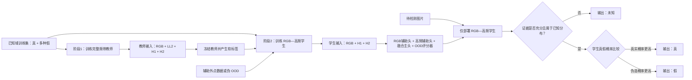

# 基于完整频带教师蒸馏与 RGB—高频检测的开放集深度伪造图片检测方案

## 1. 修改后的任务定义

模型最终提供三个**输出结果**：

1. **真（Real）**：输入属于模型已覆盖的真实原图分布，并且真实性证据充分。
2. **假（Fake）**：输入存在充分的伪造证据。换脸伪造、身份替换、属性编辑和 AI 全合成都合并为“假”。
3. **未知（Unknown）**：模型没有足够证据可靠判断，或者输入明显超出训练分布，因此输出“不知道/无法可靠判断”。

这里需要做一个重要修正：第三个输出不建议称为“不真不假”，正式写作时应称为**未知、拒识或 OOD 输出**。一张图在客观上仍然是真或假，只是模型当前无法可靠判断。

因此，本任务不是普通的三分类，而是：

> **真/假二分类 + OOD 拒识机制 = 真、假、未知三个输出。**

OOD 是 **out-of-distribution** 的缩写，不是 ODD。它表示输入不属于模型训练时所覆盖的已知分布。

---

## 2. 哪些图片应该输出“未知”

建议将以下输入纳入未知或拒识范围：

- 极端模糊、严重压缩、分辨率过低，无法提取可靠取证痕迹；
- 人脸区域缺失、遮挡严重或检测失败；
- 非人脸图片、多人脸关系不明确或输入格式异常；
- RGB 分支认为是真，而高频分支强烈认为是假，两个部署证据源发生明显冲突；
- 与训练集中的真实和伪造分布都相距很远的新型输入；
- 对抗扰动、异常后处理或尚未覆盖的新型生成管线，使模型证据不足。

需要注意：**未知生成器产生的图片不应该自动判为未知。**如果模型在其中检测到充分且稳定的伪造证据，仍应输出“假”；只有证据不足或超出模型能力边界时才输出“未知”。这一区分可以防止模型为了提高拒识率，把所有困难伪造都推给“未知”。

---

## 3. 方法总体结构

本方案把“小波怎样用于学习”和“小波怎样用于检测”明确分开：

- **阶段1：完整频带教师学习。** 教师同时使用 RGB、低频 $LL_2$ 和两级高频 $H_1,H_2$，学习较完整的真假边界和跨频带关系；
- **阶段2：RGB—高频学生学习。** 学生从训练开始就只接收 RGB 与两级高频，通过真实标签和教师软标签学习；
- **推理阶段：只部署学生。** 最终真假检测由 RGB 空间证据和多尺度高频取证证据完成，低频不进入部署分类器。

这里的教师不是学生参数的 EMA 副本，而是输入信息更完整的**特权信息教师**。教师在训练阶段提供指导，学生才是最终部署模型。这样可以同时满足：

- 学习阶段充分利用低频结构、跨频带一致性和高频伪造痕迹；
- 检测阶段避免低频与 RGB 的冗余；
- 防止最终模型过度依赖身份、背景、亮度等低频语义捷径；
- 学生训练输入与推理输入完全一致，不产生“训练使用低频、推理突然删除低频”的分布偏移。

---

## 4. 输入表示、完整频带教师与 RGB—高频学生

### 4.1 二层小波分解与频带分工

对输入图像 $x$ 执行二层离散小波变换：

$$
W_2(x)=\{LL_2,LH_2,HL_2,HH_2,LH_1,HL_1,HH_1\}.
$$

定义两级高频集合：

$$
H_1=[LH_1,HL_1,HH_1],\qquad
H_2=[LH_2,HL_2,HH_2].
$$

三类信息承担不同作用：

- RGB：人脸结构、颜色、光照、融合区域和完整空间语义；
- $LL_2$：较粗的轮廓、低频结构和光照，只供训练阶段教师使用；
- $H_1,H_2$：不同尺度的边缘、皮肤纹理、生成噪声、重采样和融合边界，是学生部署时使用的主要小波取证信息。

第一版使用固定 Haar 小波建立基线，之后再比较 Daubechies 等小波基。一级和二级子带具有不同空间分辨率，不能未经处理直接按通道拼接；应分别编码后在特征层对齐尺度。

### 4.2 完整频带教师

教师由 RGB、低频和高频三个编码分支组成：

$$
r_T=F_r^T(x),\qquad
l_T=F_l^T(LL_2),
$$

$$
h_{1T}=F_{h1}^T(H_1),\qquad
h_{2T}=F_{h2}^T(H_2).
$$

将两个尺度的高频特征对齐并融合：

$$
h_T=F_H^T\!\left([A_1(h_{1T});A_2(h_{2T})]\right),
$$

其中 $A_1,A_2$ 表示上采样、下采样或投影操作。教师融合特征为：

$$
z_T=F_T([r_T;l_T;h_T]),
$$

教师 logits 与真假概率为：

$$
a_T=C_T(z_T),\qquad
p_T=\operatorname{softmax}(a_T).
$$

教师的作用是利用完整频带形成较充分的训练指导，而不是作为最终检测器。教师训练完成后冻结参数，在学生训练期间只生成软标签和可选的高级特征目标。

### 4.3 RGB—高频学生

学生从训练到推理都只接收 RGB、$H_1$ 和 $H_2$：

$$
r=F_r^S(x),
$$

$$
h_1=F_{h1}^S(H_1),\qquad
h_2=F_{h2}^S(H_2),
$$

$$
h=F_H^S\!\left([A_1(h_1);A_2(h_2)]\right).
$$

学生的 RGB 分支保留空间结构和语义，高频分支学习生成纹理、皮肤细节、噪声、重采样和融合边界。学生不读取 $LL_2$，因此其部署能力不能依赖低频小波输入。标准 DWT 实现可能仍会同时计算出 $LL_2$，但该张量在学生前向传播中被丢弃，不参与真假分类和 OOD 特征计算。

### 4.4 RGB—高频门控融合

将 RGB 和高频特征映射到相同维度：

$$
\bar r=P_r(r),\qquad \bar h=P_h(h).
$$

显式计算共同证据和分歧证据：

$$
c=\bar r\odot\bar h,\qquad d=|\bar r-\bar h|.
$$

门控网络根据图像内容自适应调整 RGB 与高频证据的权重：

$$
g=\sigma\!\left(G([\bar r;\bar h;c;d])\right),
$$

$$
z_g=g\odot\bar r+(1-g)\odot\bar h,
$$

$$
\boxed{
z_S=\operatorname{MLP}([z_g;c;d]).
}
$$

学生融合主头输出：

$$
a_S=C_S(z_S),\qquad
p_S=\operatorname{softmax}(a_S).
$$

该设计不强迫 RGB 与高频特征完全相同。高清图像中，高频分支可以提供较强的取证证据；严重压缩或模糊导致高频受损时，门控网络可以提高 RGB 分支的相对贡献。

---

## 5. 阶段1：完整频带教师学习

### 5.1 教师的目标与边界

阶段1使用带标签的真实与伪造图片训练完整频带教师。教师同时读取 RGB、$LL_2$、$H_1$ 和 $H_2$，目标是形成比部署学生更充分的真假判断，并为学生提供软标签。教师不是最终检测器，也不参与最终 OOD 阈值的确定。

教师融合主头使用真实真假标签训练：

$$
\boxed{
\mathcal L_{T,main}=\operatorname{CE}(p_T,y)
}
$$

教师可以设置 RGB、低频和高频辅助头，检查三个信息源是否被实际使用，但教师最终输出仍由完整频带融合头产生。低频辅助头的权重应较小，避免教师主要依赖身份、背景或亮度等低频语义捷径。

### 5.2 教师的数据增强与频带随机丢弃

训练教师时可以对 RGB、低频和高频视图进行适度增强与随机遮挡，防止教师只记住某个区域或固定频带。用于给学生产生软标签时，教师必须切换为评估模式并使用未遮挡的完整频带输入。

#### RGB视图的局部遮挡

先对训练图片进行随机裁剪、轻度 JPEG、缩放、模糊、噪声或颜色扰动，记为 $a_r(x_i)$；再生成局部二值掩码 $M_i^r$：

$$
\widetilde x_i^r
=M_i^r\odot a_r(x_i)
+(1-M_i^r)\odot v_{mask}.
$$

其中：

- $M_i^r=1$ 表示该位置可见，$M_i^r=0$ 表示该位置被遮挡；
- $v_{mask}$ 是遮挡填充值，可以使用数据集 RGB 均值、随机噪声或可学习的 mask token；
- $\odot$ 表示逐元素乘法；
- $\widetilde x_i^r$ 是送入 RGB 编码器的遮挡视图。

建议第一版随机遮挡图片面积的 20%～30%，以连续矩形块或 patch 为单位遮挡，而不是随机删除孤立像素；同时至少保留 60% 的有效人脸区域。

#### 小波视图的局部遮挡

先对与 RGB 视图采用相同几何变换、但可采用独立轻度退化的视图 $a_w(x_i)$ 进行二层 DWT：

$$
X_i^w=W_2(a_w(x_i)).
$$

对每个小波子带 $b$ 生成局部掩码 $M_{i,b}^w$：

$$
\widetilde X_{i,b}^w
=M_{i,b}^w\odot X_{i,b}^w,
\qquad b\in\mathcal B,
$$

其中：

$$
\mathcal B=
\{LL_2,LH_2,HL_2,HH_2,LH_1,HL_1,HH_1\}.
$$

小波遮挡包括两种形式：

1. **局部空间遮挡**：在小波特征图上遮挡 20%～30% 的局部区域；
2. **高频子带丢弃**：以 10%～20% 的概率暂时将某一个 $LH、HL$ 或 $HH$ 高频子带置零。

为避免完全破坏输入，不同时丢弃全部高频子带，第一版也不完整丢弃 $LL_2$ 低频子带。

#### 不同频带采用受控掩码

几何变换必须在 RGB 与小波输入之间保持一致，例如使用相同的裁剪、翻转和旋转，从而保证空间对应关系。完成几何变换后，可以对 RGB、低频和高频分别施加轻度独立遮挡，使一类信息缺失时仍可由其他频带补充。

但两个视图不能破坏得过重，应保证它们仍然可以被识别为来自同一张图片。推荐初始设置为：

| 增强项目 | 初始设置 |
|---|---|
| RGB局部遮挡比例 | 20%～30% |
| 小波局部遮挡比例 | 20%～30% |
| 单个高频子带丢弃概率 | 10%～20% |
| RGB与小波掩码关系 | 几何位置对齐，遮挡可独立采样 |
| 最低有效内容比例 | 不低于60% |

这些比例不是固定结论，需要通过 0%、10%、20%、30%、40% 等遮挡率消融实验确定。

#### 局部遮挡后的学习目标

局部遮挡只是一种教师训练增强，核心目标仍是真假分类。它不要求恢复原始像素，也不改变真假标签。应比较不遮挡、局部遮挡和频带随机丢弃三个版本，确认增强确实提高跨生成器和退化条件下的泛化，而不是降低教师上限。

### 5.3 教师分类与分支辅助损失

教师融合主头根据完整频带特征输出 $p_T$。为避免融合网络完全忽略某类信息，可以为 RGB、高频和低频设置辅助头：

$$
p_T^r=\operatorname{softmax}(C_T^r(r_T)),\qquad
p_T^h=\operatorname{softmax}(C_T^h(h_T)),\qquad
p_T^l=\operatorname{softmax}(C_T^l(l_T)).
$$

教师损失为：

$$
\boxed{
\mathcal L_T
=\mathcal L_{T,main}
+\lambda_r\operatorname{CE}(p_T^r,y)
+\lambda_h\operatorname{CE}(p_T^h,y)
+\lambda_l\operatorname{CE}(p_T^l,y)
}
$$

其中建议设置 $\lambda_l<\lambda_h$，使低频承担辅助结构学习，而不是成为主要伪造判据。需要分别报告教师的 RGB、高频、低频和完整频带性能，确认教师增益来自信息互补，而不是数据格式捷径。

### 5.4 教师退化一致性与冻结

对同一图片构造原始视图 $x$ 和合理退化视图 $\tilde x$。退化可包括 JPEG、缩放、模糊、噪声或二次编码。教师退化一致性损失为：

$$
\boxed{
\mathcal L_{T,rob}
=\operatorname{JS}\bigl(p_T(x),p_T(\tilde x)\bigr)
+\beta_T\left\|z_T(x)-z_T(\tilde x)\right\|_1
}
$$

阶段1总损失为：

$$
\boxed{
\mathcal L_{stage1}=\mathcal L_T+\lambda_{T,rob}\mathcal L_{T,rob}
}
$$

教师训练完成后冻结全部参数。阶段2中，教师对未遮挡的完整频带输入产生 logits 和高级特征；教师不参与反向传播。学生的 RGB 和高频编码器可以由教师对应分支初始化，但学生随后独立优化，并且从训练开始不读取 $LL_2$。只有当完整频带教师在独立验证集上的分类、校准或跨生成器表现优于未蒸馏学生基线时，才有理由把它用于蒸馏；否则应保留 RGB—高频学生而取消教师蒸馏。

---

## 6. 阶段2：RGB—高频学生蒸馏与 OOD 联合训练

阶段2使用带标签数据：

$$
\mathcal D_{ID}=\mathcal D_R\cup\mathcal D_F,
$$

其中 $\mathcal D_R$ 为真实原图，$\mathcal D_F$ 包含换脸、身份替换、属性编辑和 AI 全合成。完整频带教师保持冻结，学生始终只读取 RGB、$H_1$ 和 $H_2$。

### 6.1 学生三个分类头怎样协同

学生保留三个分类头：

1. RGB 辅助头 $C_r$，根据 $r$ 独立判断真/假；
2. 高频辅助头 $C_h$，根据 $h$ 独立判断真/假；
3. 融合主头 $C_S$，根据融合特征 $z_S$ 给出最终真/假预测。

三个分类头分别输出：

$$
p^r=\operatorname{softmax}(C_r(r)),\qquad
p^h=\operatorname{softmax}(C_h(h)),\qquad
p_S=\operatorname{softmax}(C_S(z_S)).
$$

其中融合主头的两个原始输出记为：

$$
C_S(z_S)=[a_R^S,a_F^S],
$$

它们既用于计算 $p_S$，也用于后续计算学生的 OOD 能量分数。

令 $y=0$ 表示真，$y=1$ 表示假。融合主头的损失为：

$$
\mathcal L_{main}=\frac{1}{N}\sum_{i=1}^{N}
\operatorname{CE}(p_i^S,y_i).
$$

两个分支辅助头的损失为：

$$
\mathcal L_{aux}=\frac{1}{2N}\sum_{i=1}^{N}
\left[
\operatorname{CE}(p_i^r,y_i)
+\operatorname{CE}(p_i^h,y_i)
\right].
$$

真假分类总损失为：

$$
\boxed{
\mathcal L_{bin}
=\mathcal L_{main}+\lambda_{aux}\mathcal L_{aux}
}
$$

这三个头的协调关系是：

- 它们都接受同一个真假标签，因此学习目标一致；
- 两个辅助头保证 RGB 和多尺度高频单独都有判别能力，防止融合网络完全忽略高频；
- 融合主头不简单平均两个辅助头的概率，而是根据两路特征、共同证据、差异证据和门控权重学习最终判断；
- 不对 $p^r$ 与 $p^h$ 施加强制相等约束，因为适度分歧正是互补信息和 OOD 判断的候选来源；
- 推理时最终真假类别由 $p_S$ 决定，$p^r,p^h$ 主要用于计算分支分歧和解释模型依据。

### 6.2 完整频带教师向学生蒸馏

教师对同一图像使用完整频带产生 logits $a_T$，学生使用 RGB 与高频产生 logits $a_S$。温度为 $\tau_{KD}$ 时，蒸馏损失为：

$$
\boxed{
\mathcal L_{KD}
=\tau_{KD}^2D_{KL}\!\left(
\operatorname{softmax}(a_T/\tau_{KD})
\parallel
\operatorname{softmax}(a_S/\tau_{KD})
\right)
}
$$

真实标签告诉学生正确类别，教师软标签提供样本难度和真假边界信息。学生不能只依赖蒸馏，必须同时保留 $\mathcal L_{main}$。如果加入特征蒸馏，只在投影后的高级特征上施加小权重约束：

$$
\mathcal L_{feat}
=\left\|P_S(z_S)-\operatorname{stopgrad}(P_T(z_T))\right\|_1.
$$

不直接要求 $z_S=z_T$，因为教师包含学生无法读取的低频信息。第一版建议先只使用 logit 蒸馏，确认有效后再加入特征蒸馏。

### 6.3 伪造子类辅助损失

虽然最终所有伪造均输出“假”，训练时仍可保留伪造来源标签：

$$
t\in\{\text{换脸},\text{身份替换},\text{属性编辑},\text{AI 全合成}\}.
$$

辅助头 $C_s$ 只对假样本预测伪造子类：

$$
\boxed{
\mathcal L_{sub}
=-\frac{1}{N_F}\sum_{i:y_i=1}\log q_{i,t_i}
}
$$

它的目的不是在推理时输出四种假，而是避免模型把所有假样本压缩成一个过于单一的模式，使模型能够覆盖不同伪造家族。

如果“换脸”和“身份替换”在数据标注中没有清晰区别，应合并这两个辅助子类，避免噪声标签。

### 6.4 学生分支随机丢弃

学生**始终保留 RGB 编码器和高频编码器两个分支**。分支随机丢弃不是删除某个分支，而是训练时对部分样本暂时遮挡一路特征，防止融合主头长期只依赖 RGB 或某个高频尺度。

定义随机掩码 $m_r,m_h\in\{0,1\}$：

$$
\widetilde r=m_r r,\qquad
\widetilde h=m_h h,
$$

并保证 $(m_r,m_h)\neq(0,0)$。初始概率可以设置为：

$$
P(1,1)=0.70,\qquad
P(1,0)=0.15,\qquad
P(0,1)=0.15.
$$

也就是说，70% 的训练样本同时使用两个分支，15% 暂时只使用 RGB，15% 暂时只使用高频。门控融合使用 $\widetilde r,\widetilde h$ 计算，但两个辅助分类头仍使用未遮挡的 $r,h$ 计算各自损失，以保证两个编码器都能持续学习。

分支随机丢弃没有单独损失函数，它是一种训练数据流策略。推理时设置：

$$
m_r=m_h=1,
$$

即 RGB 与多尺度高频两个分支同时启用。低频教师分支在学生推理时不存在。

### 6.5 原图—退化图一致性损失

对已知样本 $x$ 和其轻度、保持标签不变的退化版本 $\tilde x$，使用学生融合主头概率 $p_S$，定义平均概率：

$$
m=\frac{p_S(x)+p_S(\tilde x)}{2}.
$$

概率一致性采用 Jensen–Shannon 散度：

$$
\operatorname{JS}(p,\tilde p)
=\frac{1}{2}D_{KL}(p\|m)
+\frac{1}{2}D_{KL}(\tilde p\|m).
$$

鲁棒损失为：

$$
\boxed{
\mathcal L_{rob}
=\operatorname{JS}\bigl(p_S(x),p_S(\tilde x)\bigr)
+\beta\left\|z_S(x)-z_S(\tilde x)\right\|_1
}
$$

第一项约束预测一致，第二项约束融合特征一致。

### 6.6 用学生能量训练 OOD 拒识

普通 Softmax 即使遇到域外输入也可能产生很高置信度，因此单独构造能量分数：

$$
\boxed{
E(x)=-T\log\left(
e^{a_R^S(x)/T}+e^{a_F^S(x)/T}
\right)
}
$$

其中 $T$ 是温度参数。训练目标是：

- 已知真/假样本的能量较低；
- 辅助外点样本的能量较高。

设辅助外点集合为 $\mathcal D_{OE}$，使用两个间隔 $m_{in}<m_{out}$：

$$
\boxed{
\begin{aligned}
\mathcal L_E
=&\frac{1}{|\mathcal D_{ID}|}
\sum_{x\in\mathcal D_{ID}}
\bigl[\max(0,E(x)-m_{in})\bigr]^2\\
&+\frac{1}{|\mathcal D_{OE}|}
\sum_{o\in\mathcal D_{OE}}
\bigl[\max(0,m_{out}-E(o))\bigr]^2.
\end{aligned}
}
$$

第一项惩罚能量过高的已知样本，第二项惩罚能量过低的外点样本，使二者之间形成可校准的间隔。

$\mathcal D_{OE}$ 可以包含：

- 与任务无关的非人脸图片；
- 严重遮挡、极低分辨率或异常编码的人脸；
- 受约束的 mixup 或频带错配样本；
- 不与最终测试 OOD 来源重合的额外背景数据。

辅助外点只是帮助模型认识开放空间，不能代表所有未知情况，因此测试时仍需使用完全未见的 OOD 集合。

### 6.7 阶段2总损失

$$
\boxed{
\mathcal L_{det}
=\mathcal L_{bin}
+\lambda_{KD}\mathcal L_{KD}
+\lambda_{feat}\mathcal L_{feat}
+\lambda_{sub}\mathcal L_{sub}
+\lambda_{rob}\mathcal L_{rob}
+\lambda_E\mathcal L_E
}
$$

推荐先训练 $\mathcal L_{bin}$ 的 RGB—高频学生基线，再加入 logit 蒸馏；只有 logit 蒸馏有效时才测试特征蒸馏，之后再逐项加入子类、鲁棒和 OOD 损失。

其中 $\mathcal L_{bin}$ 已经包含学生融合主头与 RGB、高频两个辅助头；$\lambda_{feat}$ 在不使用特征蒸馏时设为 0。$\mathcal L_{KD}$ 和 $\mathcal L_{feat}$ 只在已知域样本上计算，OE 样本只参与 OOD 能量训练。分支随机丢弃不额外增加损失项，只改变部分训练样本进入学生融合模块的特征组合。

---

## 7. 推理阶段：怎样输出真、假或未知

推理阶段删除完整频带教师和低频编码器，只部署 RGB—高频学生。学生不再进行分支随机丢弃，RGB 与多尺度高频分支均完整启用。两个辅助头分别产生 $p^r,p^h$，融合主头产生最终概率 $p_S=[p_R^S,p_F^S]$。

### 7.1 三种 OOD 证据

#### 证据一：能量分数

$E(x)$ 越高，输入越可能不属于训练时的真/假已知分布。

#### 证据二：到已知原型的距离

学生训练完成后，为真实类和四种伪造子类计算学生特征原型：

$$
c_k=\operatorname{norm}\left(
\frac{1}{|\mathcal D_k|}
\sum_{x_i\in\mathcal D_k}z_{S,i}
\right).
$$

输入到最近已知原型的距离为：

$$
\boxed{
d_{proto}(x)=\min_{k\in\mathcal K}
\left[1-z_S(x)^\top c_k\right]
}
$$

其中 $\mathcal K$ 包括真实原型以及换脸、身份替换、属性编辑、全合成等伪造原型。距离越大，说明输入越不像任何已知样本族。

#### 证据三：RGB 与高频分支的判断分歧

让学生的 RGB 分支和高频分支分别输出真假概率 $p^r,p^h$，定义：

$$
\boxed{
d_{agree}(x)=\operatorname{JS}(p^r(x),p^h(x))
}
$$

分歧越大，说明空间证据和高频取证证据发生冲突。但压缩、模糊和缩放也会造成分歧，因此该指标不能单独决定 OOD，必须在独立退化校准集上检验其增量价值。若分歧在退化图上误报严重，应降低 $w_A$ 或删除该项。

### 7.2 综合 OOD 分数

在独立校准集上将三种分数标准化为 $\widetilde E,\widetilde d_{proto},\widetilde d_{agree}$，再定义：

$$
\boxed{
S_{ood}(x)
=w_E\widetilde E(x)
+w_P\widetilde d_{proto}(x)
+w_A\widetilde d_{agree}(x)
}
$$

不预设三个证据同等可靠。第一版先使用能量分数建立基线，再在独立校准集上依次加入原型距离和分支分歧；只有验证带来稳定增益时才保留。所有权重和阈值都不能使用最终测试集选择。

### 7.3 最终判决公式

$$
\boxed{
\widehat y(x)=
\begin{cases}
\text{未知}, & S_{ood}(x)>\tau_{ood}
\ \text{或}\ \max(p_R^S,p_F^S)<\tau_{conf},\\[4pt]
\text{真}, & p_R^S\ge p_F^S,\\[4pt]
\text{假}, & p_F^S>p_R^S.
\end{cases}
}
$$

这就是最终三个输出的产生方式：

1. 先判断模型有没有能力可靠回答；
2. 没能力时输出未知；
3. 有能力时才在真和假之间选择。

阈值 $\tau_{ood}$ 与 $\tau_{conf}$ 应在独立校准集上按照实际需求确定。例如，若更重视减少“把假判真”，可以接受更高拒识率，选择更严格的阈值。

---

## 8. 训练数据怎样组织

### 8.1 已知域数据

- 真：真实相机原图，明确常规压缩、缩放和美化是否仍视为真；
- 假—换脸：人脸区域由另一身份替换；
- 假—身份替换：根据数据生成流程定义，避免与换脸标签重叠；
- 假—属性编辑：年龄、表情、发型、局部五官等发生生成式编辑；
- 假—AI 全合成：检测区域整体由 GAN 或扩散模型生成。

最终训练真/假主头时，四种伪造均映射到 $y=1$；伪造子类标签只供辅助头和原型计算使用。教师与学生必须使用相同的训练划分，教师不能在学生测试集或 OOD 测试集上训练，否则蒸馏会造成数据泄漏。

### 8.2 OOD 校准与测试数据

至少分成三个互不重合的集合：

- **OE 训练集**：训练能量间隔使用的辅助外点；
- **OOD 校准集**：选择阈值与组合权重；
- **OOD 测试集**：最终报告结果，来源不能与前两者重复。

### 8.3 避免数据捷径

三类输出系统仍必须控制：

- 真实图全部是 JPEG、伪造图全部是 PNG；
- 不同来源具有固定分辨率、水印或元数据；
- 同一原图及其伪造版本跨训练集和测试集；
- 某一种内容主题只出现在真实或伪造类；
- OOD 测试集与 OE 训练集来源重合。

---

## 9. 泛化、鲁棒和拒识必须分开评价

### 9.1 已知域真假分类

报告：Accuracy、Balanced Accuracy、真/假 F1、ROC-AUC、混淆矩阵和 ECE。

### 9.2 未知伪造方法上的泛化

留出一种换脸方法、编辑方法或生成器，不参与训练。测试时重点观察这些样本有多少被正确判为“假”，而不是全部被推给“未知”。建议报告：

- 未知伪造的 Fake Recall；
- 未知伪造的 Unknown Rate；
- 已知与未知生成器分别对应的 AUC。

### 9.3 OOD 拒识能力

报告：

- OOD AUROC；
- FPR@95TPR；
- OSCR（Open Set Classification Rate）；
- Risk–Coverage 曲线；
- 已知样本误拒率；
- OOD 样本正确拒识率。

### 9.4 图像退化鲁棒性

分别测试 JPEG、缩放、模糊、噪声、二次编码、截图和社交平台转码，并同时报告：

- 真/假分类性能；
- 退化强度增加时的未知输出比例；
- RGB、高频、RGB—高频学生以及完整频带教师的性能曲线。

严重退化样本输出未知可能是合理行为，但轻微退化就大量拒识说明模型并不鲁棒。

---

## 10. 建议的消融实验顺序

| 编号 | 模型 | 验证问题 |
|---|---|---|
| B0 | RGB + 真/假二分类 | 基础真假性能 |
| B1 | 仅多尺度高频 + 真/假二分类 | 高频是否具有独立判别能力 |
| B2 | RGB + 多尺度高频 + 简单拼接 | 高频对 RGB 是否有增益 |
| B3 | RGB + 多尺度高频 + 门控融合 | 自适应融合是否有效 |
| B4 | B3 + RGB/高频辅助真假头 | 两个部署分支是否都被有效使用 |
| B5 | 完整频带教师 | RGB、低频和高频联合学习的性能上限 |
| B6 | B4 + 教师 logit 蒸馏 | 低频特权信息是否改善学生泛化 |
| B6a | B6 + 特征蒸馏 | 高级特征蒸馏是否提供额外增益 |
| B7 | B6 + 学生分支/高频子带随机丢弃 | 是否降低对单一证据源的依赖 |
| B8 | B7 + 伪造子类辅助头 | 多种伪造覆盖是否改善 |
| B9 | B8 + 鲁棒一致性 | 压缩和缩放下是否更稳定 |
| B10 | B9 + 能量拒识 | 是否能识别 OOD |
| B11 | B10 + 学生原型距离 | 特征距离是否提供额外信息 |
| B12 | B11 + RGB—高频分歧 | 部署分支冲突是否有助于拒识 |

还需比较：

- 单一 Softmax 阈值与综合 OOD 分数；
- 不使用辅助头、使用辅助头但不随机丢弃、辅助头加随机丢弃；
- 教师不遮挡、仅 RGB 遮挡、仅低频/高频遮挡和受控频带丢弃；
- 0%、10%、20%、30%、40%局部遮挡率；
- 一层/二层 DWT；
- Haar/Daubechies 小波；
- 无蒸馏、logit 蒸馏、logit + 特征蒸馏；
- 学生直接删除低频与本方案“从训练开始不输入低频”的比较；
- 有无 OE 训练数据；
- 相同参数量的纯 RGB 对照模型；
- 完整频带教师与 RGB—高频学生的参数量、推理速度和鲁棒性比较。

---

## 11. 推荐实施顺序

1. 先完成 RGB 真/假二分类，确认数据没有格式捷径。
2. 使用二层 Haar DWT，先训练“仅高频”和“RGB＋高频”学生基线，明确一级、二级高频的处理和尺度对齐方式。
3. 给学生的 RGB 与高频分支分别增加辅助真假头，检查高频是否具有独立判别能力。
4. 单独训练 RGB＋低频＋高频的完整频带教师，并报告各频带辅助头性能，排查低频数据捷径。
5. 冻结教师，用真实标签与教师软标签训练 RGB—高频学生；先只做 logit 蒸馏，不立即加入特征蒸馏。
6. 若 logit 蒸馏有效，再测试特征蒸馏、分支随机丢弃和高频子带随机丢弃。推理时始终只启用学生的 RGB 与高频分支。
7. 用四种伪造子类做辅助训练，但最终统一输出假。
8. 加入原图—退化图一致性，完成 JPEG、缩放、模糊和二次编码鲁棒性测试。
9. 先用学生能量分数实现最小可用的未知拒识，再依次加入学生原型距离与 RGB—高频分歧，检查其独立增益。
10. 最后完成跨生成器、跨数据集、图像退化和 OOD 四组测试，并比较教师与学生的性能、参数量和推理成本。

不建议一开始同时实现全部模块，否则结果变好或变差时无法知道是哪一项造成的。

---

## 12. 与原方案、直接删低频方案和 RealForensics 的区别

| 部分 | 原方案 | 直接训练后删低频 | 当前修订方案 |
|---|---|---|---|
| 输出定义 | 真、局部伪造、全合成 | 真、假、未知 | 真、假、未知/拒识 |
| 教师结构 | EMA 教师 | 无 | 完整频带特权信息教师 |
| 教师输入 | 与学生近似相同 | 无 | RGB + $LL_2$ + $H_1$ + $H_2$ |
| 学生输入 | RGB/小波共同输入 | 训练含低频、推理删低频 | 训练和推理始终为 RGB + $H_1$ + $H_2$ |
| 低频作用 | 与其他频带共同分类 | 训练依赖后突然删除 | 只用于教师训练指导，不进入部署学生 |
| 参数更新 | 学生梯度 + 教师 EMA | 单模型直接训练 | 先训练并冻结教师，再蒸馏学生 |
| 部署分支 | 原方案指定分支 | RGB + 高频 | RGB辅助头 + 高频辅助头 + 融合主头 |
| 训练—推理一致性 | 取决于原实现 | 不一致 | 一致 |
| 未知处理 | 没有 | 可选 | 学生能量 + 学生原型距离 + RGB—高频分歧 |
| 推理逻辑 | 直接输出三类 | 直接真假分类 | 先决定是否拒识，再判断真/假 |

当前方案与 RealForensics 的教师用途不同：RealForensics 的教师主要用于提供稳定目标，本方案的教师则因为额外读取低频而承担“完整频带训练指导”。低频知识通过软标签或高级特征蒸馏进入学生，但学生从未把低频作为输入，因此不会在部署时产生突然删除低频的分布偏移。

---

## 13. 一段话口头汇报版本

本研究拟构建一个“学习阶段利用完整频带、检测阶段聚焦 RGB 与多尺度高频”的开放集深度伪造图片检测器，最终输出真、假或未知。第一阶段训练完整频带教师，教师同时读取 RGB、低频 $LL_2$ 以及两级高频 $H_1,H_2$，利用完整结构和频率信息学习真假边界；第二阶段冻结教师，训练从始至终只接收 RGB、$H_1$ 和 $H_2$ 的学生，学生同时接受真实真假标签和教师软标签，并通过 RGB 辅助头、高频辅助头与融合主头保证两类部署证据都被有效使用。低频只作为训练阶段的特权信息，不进入最终学生分类器，避免低频与 RGB 重复以及训练后直接删低频造成的分布偏移。推理时只部署 RGB—高频学生，先使用学生能量、学生原型距离和经校准的 RGB—高频分歧判断是否拒识，再在证据充分时输出真或假；最后通过跨生成器、跨数据集、图像退化和 OOD 实验分别检验泛化性、鲁棒性与拒识能力。

---

## 14. 参考依据

1. [Towards Open Set Deep Networks, CVPR 2016](https://openaccess.thecvf.com/content_cvpr_2016/html/Bendale_Towards_Open_Set_CVPR_2016_paper.html)
2. [Energy-based Out-of-distribution Detection, NeurIPS 2020](https://proceedings.neurips.cc/paper/2020/hash/f5496252609c43eb8a3d147ab9b9c006-Abstract.html)
3. [LORD: Leveraging Open-Set Recognition with Unknown Data, ICCVW 2023](https://openaccess.thecvf.com/content/ICCV2023W/OODCV/html/Koch_LORD_Leveraging_Open-Set_Recognition_with_Unknown_Data_ICCVW_2023_paper.html)
4. [Open Set Classification of GAN-Based Image Manipulations, CVPRW 2023](https://openaccess.thecvf.com/content/CVPR2023W/WMF/html/Wang_Open_Set_Classification_of_GAN-Based_Image_Manipulations_via_a_ViT-Based_CVPRW_2023_paper.html)
5. [Multi-Scale Wavelet Transformer for Face Forgery Detection, ACCV 2022](https://openaccess.thecvf.com/content/ACCV2022/papers/Liu_Multi-Scale_Wavelet_Transformer_for_Face_Forgery_Detection_ACCV_2022_paper.pdf)
6. [D3: Scaling Up Deepfake Detection by Learning from Discrepancy, CVPR 2025](https://openaccess.thecvf.com/content/CVPR2025/html/Yang_D3_Scaling_Up_Deepfake_Detection_by_Learning_from_Discrepancy_CVPR_2025_paper.html)
7. [Distilling the Knowledge in a Neural Network, 2015](https://arxiv.org/abs/1503.02531)
