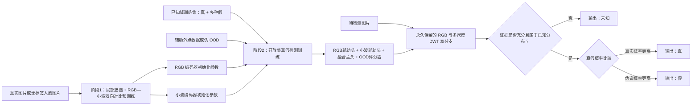

# 基于 RGB—小波协同与 OOD 拒识的开放集深度伪造图片检测方案

## 1. 修改后的任务定义

模型最终提供三个**输出结果**：

1. **真（Real）**：输入属于模型已覆盖的真实原图分布，并且真实性证据充分。
2. **假（Fake）**：输入存在充分的伪造证据。换脸伪造、身份替换、属性编辑和 AI 全合成都合并为“假”。
3. **未知（Unknown）**：模型没有足够证据可靠判断，或者输入明显超出训练分布，因此输出“不知道/无法可靠判断”。

这里需要做一个重要修正：第三个输出不建议称为“不真不假”，正式写作时应称为**未知、拒识或 OOD 输出**。一张图在客观上仍然是真或假，只是模型当前无法可靠判断。

因此，本任务不是普通的三分类，而是：

> **真/假二分类 + OOD 拒识机制 = 真、假、未知三个输出。**

OOD 是 **out-of-distribution** 的缩写，不是 ODD。它表示输入不属于模型训练时所覆盖的已知分布。

---

## 2. 哪些图片应该输出“未知”

建议将以下输入纳入未知或拒识范围：

- 极端模糊、严重压缩、分辨率过低，无法提取可靠取证痕迹；
- 人脸区域缺失、遮挡严重或检测失败；
- 非人脸图片、多人脸关系不明确或输入格式异常；
- RGB 分支认为是真，而小波分支强烈认为是假，两个证据源发生明显冲突；
- 与训练集中的真实和伪造分布都相距很远的新型输入；
- 对抗扰动、异常后处理或尚未覆盖的新型生成管线，使模型证据不足。

需要注意：**未知生成器产生的图片不应该自动判为未知。**如果模型在其中检测到充分且稳定的伪造证据，仍应输出“假”；只有证据不足或超出模型能力边界时才输出“未知”。这一区分可以防止模型为了提高拒识率，把所有困难伪造都推给“未知”。

---

## 3. 方法总体结构

与原先方案相比，本方案不再沿用 RealForensics 的教师—学生 EMA 结构。两个阶段分别解决：

- **阶段1**：只在 projector 空间对齐 RGB 与小波的共同信息，编码器原始特征仍保留各自特有信息；
- **阶段2**：利用两个辅助分类头、一个融合主头和分支随机丢弃学习互补性，同时学习真/假边界与 OOD 拒识。

需要区分“共同特征”和“正常特征”：

- RGB 与小波的共同特征，是两种表示中都能稳定表达的信息，例如人脸结构、轮廓和内容对应关系；
- 如果阶段1只使用真实图片，这些共同特征可以作为**真实图片的跨域一致性先验**；
- 但它们不完全等于“正常图片该有的特征”，因为其中也可能包含身份、姿态、表情和背景等与真假无关的信息；
- 真正的真假边界仍然需要阶段2的人工标签来学习。

---

## 4. 输入表示与双分支网络

### 4.1 RGB 分支

原始图片记为 $x$，RGB 编码器记为 $F_r$：

$$
h_r=F_r(x).
$$

$h_r$ 主要保留人脸结构、语义、边界、局部外观和颜色关系。

### 4.2 小波分支

对图片执行二层离散小波变换：

$$
X_w=W_2(x)
=\{LL_2,LH_2,HL_2,HH_2,LH_1,HL_1,HH_1\}.
$$

其中：

- $LL_2$ 保留较粗的低频结构；
- $LH、HL、HH$ 表示不同方向的高频边缘和纹理；
- 第一层与第二层共同构成多尺度频率信息。

小波编码器记为 $F_w$：

$$
h_w=F_w(X_w).
$$

第一版建议使用 Haar 小波建立基线，之后再比较 Daubechies 等小波基。

### 4.3 保留共同信息、独有信息和分歧信息的门控融合

先把两个分支映射到相同维度：

$$
r=P_r(h_r),\qquad w=P_w(h_w).
$$

除了分别保留 $r$ 和 $w$，再显式计算两种交互信息：

$$
c=r\odot w,\qquad d=|r-w|.
$$

其中 $c$ 表示两个分支共同支持的证据，$d$ 表示空间域与频率域之间的差异或冲突。门控网络根据全部信息计算每个样本对两个分支的依赖程度：

$$
g=\sigma\!\left(G([r;w;c;d])\right),
$$

先形成自适应加权特征：

$$
z_g=g\odot r+(1-g)\odot w,
$$

再把加权特征、共同证据和差异证据一起送入融合网络：

$$
\boxed{
z=\operatorname{MLP}([z_g;c;d]).
}
$$

符号解释：

- $P_r,P_w$：将两种特征映射到相同维度的网络；
- $[r;w]$：特征拼接；
- $c=r\odot w$：RGB 与小波共同支持的证据；
- $d=|r-w|$：两个分支的互补差异或冲突；
- $G$：根据两路特征及其关系产生门控权重的网络；
- $\sigma$：Sigmoid，使门值位于 0 到 1；
- $\odot$：逐元素乘法；
- $\operatorname{LN}$：Layer Normalization；
- $z$：最终融合特征。

该设计不会强迫两种特征完全相同。它既保留 $r,w$ 中的独有信息，又利用 $c$ 中的一致证据和 $d$ 中的分歧证据；在严重压缩导致小波高频受损时，门控网络也可以提高 RGB 分支的权重。

---

## 5. 阶段1：RGB—小波双向对比预训练

### 5.1 阶段1的目标

阶段1不训练真/假分类器，也不使用教师网络。它只要求同一张图片在 **projector 输出空间**中的 RGB 表示和小波表示彼此接近，不同图片的表示彼此区分，从而学习空间域与频率域之间稳定的对应关系。

这里不能要求编码器原始特征 $h_r$ 与 $h_w$ 完全相同。否则模型可能只保留两种域的公共信息，反而丢失 RGB 特有的空间证据和小波特有的频率证据。因此采用两层表示：

- $h_r,h_w$：编码器原始特征，保留共同信息和各自独有信息，阶段2真正使用；
- $u,v$：经过 projector 后的对比特征，只负责寻找跨域共同部分，阶段1结束后删除。

核心版本可先只用真实图片，以减少对具体伪造方法的依赖；同时应设置“仅真实预训练”和“全部训练图片预训练”的消融实验。

### 5.2 局部增强与随机遮挡

阶段1明确对 RGB 视图和小波视图进行局部增强与随机遮挡。其目的不是人为制造伪造区域，而是防止模型只记住某一个局部纹理或某一个固定频带，迫使模型利用人脸不同区域以及空间域—频率域之间的稳定联系。

#### RGB视图的局部遮挡

先对真实图片进行随机裁剪、轻度 JPEG、缩放、模糊、噪声或颜色扰动，记为 $a_r(x_i)$；再生成局部二值掩码 $M_i^r$：

$$
\widetilde x_i^r
=M_i^r\odot a_r(x_i)
+(1-M_i^r)\odot v_{mask}.
$$

其中：

- $M_i^r=1$ 表示该位置可见，$M_i^r=0$ 表示该位置被遮挡；
- $v_{mask}$ 是遮挡填充值，可以使用数据集 RGB 均值、随机噪声或可学习的 mask token；
- $\odot$ 表示逐元素乘法；
- $\widetilde x_i^r$ 是送入 RGB 编码器的遮挡视图。

建议第一版随机遮挡图片面积的 20%～30%，以连续矩形块或 patch 为单位遮挡，而不是随机删除孤立像素；同时至少保留 60% 的有效人脸区域。

#### 小波视图的局部遮挡

先对另一独立增强视图 $a_w(x_i)$ 进行二层 DWT：

$$
X_i^w=W_2(a_w(x_i)).
$$

对每个小波子带 $b$ 生成局部掩码 $M_{i,b}^w$：

$$
\widetilde X_{i,b}^w
=M_{i,b}^w\odot X_{i,b}^w,
\qquad b\in\mathcal B,
$$

其中：

$$
\mathcal B=
\{LL_2,LH_2,HL_2,HH_2,LH_1,HL_1,HH_1\}.
$$

小波遮挡包括两种形式：

1. **局部空间遮挡**：在小波特征图上遮挡 20%～30% 的局部区域；
2. **高频子带丢弃**：以 10%～20% 的概率暂时将某一个 $LH、HL$ 或 $HH$ 高频子带置零。

为避免完全破坏输入，不同时丢弃全部高频子带，第一版也不完整丢弃 $LL_2$ 低频子带。

#### 两个分支采用独立掩码

RGB掩码 $M_i^r$ 与小波掩码 $M_{i,b}^w$ 独立采样，不要求遮挡完全相同的位置。例如，RGB视图可以遮挡眼睛附近，而小波视图遮挡嘴部对应区域。这样一条分支缺失的局部信息仍可能在另一条分支中保留，能够促使模型学习跨区域、跨域对应关系。

但两个视图不能破坏得过重，应保证它们仍然可以被识别为来自同一张图片。推荐初始设置为：

| 增强项目 | 初始设置 |
|---|---|
| RGB局部遮挡比例 | 20%～30% |
| 小波局部遮挡比例 | 20%～30% |
| 单个高频子带丢弃概率 | 10%～20% |
| RGB与小波掩码关系 | 独立采样 |
| 最低有效内容比例 | 不低于60% |

这些比例不是固定结论，需要通过 0%、10%、20%、30%、40% 等遮挡率消融实验确定。

#### 局部遮挡后的学习目标

本方案不要求模型恢复被遮挡的原始像素，而是要求：即使 RGB 与小波分别只观察到部分信息，两者的 projector 输出仍能正确匹配同一张图片。

因此，局部遮挡负责增加任务难度，双向对比损失负责提供训练目标。它与 RealForensics 的区别是：RealForensics 让学生从遮挡输入预测教师的完整目标；本方案没有教师网络，而是让两个经过独立遮挡的域进行双向对比匹配。

### 5.3 双向跨域对比损失

对一个包含 $N$ 张图片的批次，令：

$$
u_i=\operatorname{norm}\bigl(Q_r(F_r(\widetilde x_i^r))\bigr),
$$

$$
v_i=\operatorname{norm}\bigl(Q_w(F_w(\widetilde X_i^w))\bigr).
$$

其中 $\widetilde x_i^r$ 与 $\widetilde X_i^w$ 分别是经过随机增强和局部遮挡后的 RGB 与小波视图，$Q_r,Q_w$ 是仅在预训练阶段使用的投影头，$u_i$ 和 $v_i$ 分别是第 $i$ 张图片的 RGB 与小波对比向量。对比损失只约束 $u_i,v_i$，不直接强迫 $h_r,h_w$ 相同。

RGB 寻找对应小波表示的损失为：

$$
\ell_i^{r\rightarrow w}
=-\log
\frac{\exp\!\left(u_i^\top v_i/\tau\right)}
{\sum_{j=1}^{N}\exp\!\left(u_i^\top v_j/\tau\right)}.
$$

小波寻找对应 RGB 表示的损失为：

$$
\ell_i^{w\rightarrow r}
=-\log
\frac{\exp\!\left(v_i^\top u_i/\tau\right)}
{\sum_{j=1}^{N}\exp\!\left(v_i^\top u_j/\tau\right)}.
$$

完整双向对比损失为：

$$
\boxed{
\mathcal L_{xcon}
=\frac{1}{2N}\sum_{i=1}^{N}
\left(\ell_i^{r\rightarrow w}+\ell_i^{w\rightarrow r}\right)
}
$$

这里：

- $u_i^\top v_i$ 是同一张图片的正样本相似度；
- $u_i^\top v_j\,(j\neq i)$ 是不同图片的负样本相似度；
- $\tau$ 是温度系数；
- 损失会拉近同一图片的 RGB—小波表示，推远错误配对。

这与 RealForensics 的“学生预测对方教师目标”不同：此处没有教师、停止梯度和 EMA，而是批次内的双向对比匹配。

### 5.4 退化不变性损失

对同一图片构造轻度视图 $x_i^{(a)}$ 和退化视图 $x_i^{(b)}$。退化可包括 JPEG、缩放、模糊、噪声或频带丢弃。得到融合特征 $z_i^{(a)}$ 与 $z_i^{(b)}$ 后，定义：

$$
\boxed{
\mathcal L_{inv}
=\frac{1}{N}\sum_{i=1}^{N}
\left\|z_i^{(a)}-z_i^{(b)}\right\|_1
}
$$

该损失要求同一内容在合理退化前后保持相近表示，为后续压缩鲁棒性提供基础。

阶段1总损失为：

$$
\boxed{
\mathcal L_{pre}=\mathcal L_{xcon}+\lambda_{inv}\mathcal L_{inv}
}
$$

局部遮挡和高频子带丢弃本身不额外产生损失项，而是改变 $\widetilde x_i^r$ 与 $\widetilde X_i^w$ 的输入内容；模型仍通过 $\mathcal L_{xcon}$ 学习遮挡视图之间的跨域对应，通过 $\mathcal L_{inv}$ 学习合理退化前后的稳定性。

阶段1结束后保留 $F_r,F_w$ 的参数初始化阶段2，删除投影头 $Q_r,Q_w$。

因此，阶段1学习到的是“真实图片中比较稳定的 RGB—小波对应关系”，而不是直接得到一个完整的“正常模板”。这个先验是否真正与真实性相关，需要在阶段2分类结果和消融实验中验证。

---

## 6. 阶段2：真假分类与 OOD 拒识联合训练

阶段2使用带标签数据：

$$
\mathcal D_{ID}=\mathcal D_R\cup\mathcal D_F,
$$

其中 $\mathcal D_R$ 为真实原图，$\mathcal D_F$ 包含换脸、身份替换、属性编辑和 AI 全合成。

### 6.1 三个分类头怎样协同

阶段2保留三个分类头：

1. RGB 辅助头 $C_r$，根据 $r$ 独立判断真/假；
2. 小波辅助头 $C_w$，根据 $w$ 独立判断真/假；
3. 融合主头 $C_f$，根据融合特征 $z$ 给出最终真/假预测。

三个分类头分别输出：

$$
p^r=\operatorname{softmax}(C_r(r)),\qquad
p^w=\operatorname{softmax}(C_w(w)),\qquad
p^f=\operatorname{softmax}(C_f(z)).
$$

其中融合主头的两个原始输出记为：

$$
C_f(z)=[a_R,a_F],
$$

它们既用于计算 $p^f$，也用于后续计算 OOD 能量分数。

令 $y=0$ 表示真，$y=1$ 表示假。融合主头的损失为：

$$
\mathcal L_{main}=\frac{1}{N}\sum_{i=1}^{N}
\operatorname{CE}(p_i^f,y_i).
$$

两个分支辅助头的损失为：

$$
\mathcal L_{aux}=\frac{1}{2N}\sum_{i=1}^{N}
\left[
\operatorname{CE}(p_i^r,y_i)
+\operatorname{CE}(p_i^w,y_i)
\right].
$$

真假分类总损失为：

$$
\boxed{
\mathcal L_{bin}
=\mathcal L_{main}+\lambda_{aux}\mathcal L_{aux}
}
$$

这三个头的协调关系是：

- 它们都接受同一个真假标签，因此学习目标一致；
- 两个辅助头保证 RGB 和小波单独都有判别能力，防止融合网络完全忽略其中一个分支；
- 融合主头不简单平均两个辅助头的概率，而是根据两路特征、共同证据、差异证据和门控权重学习最终判断；
- 不对 $p^r$ 与 $p^w$ 施加强制相等约束，因为适度分歧正是互补信息和 OOD 判断的重要来源；
- 推理时最终真假类别由 $p^f$ 决定，$p^r,p^w$ 主要用于计算分支分歧和解释模型依据。

### 6.2 伪造子类辅助损失

虽然最终所有伪造均输出“假”，训练时仍可保留伪造来源标签：

$$
t\in\{\text{换脸},\text{身份替换},\text{属性编辑},\text{AI 全合成}\}.
$$

辅助头 $C_s$ 只对假样本预测伪造子类：

$$
\boxed{
\mathcal L_{sub}
=-\frac{1}{N_F}\sum_{i:y_i=1}\log q_{i,t_i}
}
$$

它的目的不是在推理时输出四种假，而是避免模型把所有假样本压缩成一个过于单一的模式，使模型能够覆盖不同伪造家族。

如果“换脸”和“身份替换”在数据标注中没有清晰区别，应合并这两个辅助子类，避免噪声标签。

### 6.3 分支随机丢弃：训练时偶尔遮挡，网络结构仍保留双分支

本方案**始终保留 RGB 编码器和小波编码器两个分支**。分支随机丢弃不是删除某个分支，而是训练时对部分样本暂时遮挡一路特征，防止融合主头长期只依赖某一个分支。

定义随机掩码 $m_r,m_w\in\{0,1\}$：

$$
\widetilde r=m_r r,\qquad
\widetilde w=m_w w,
$$

并保证 $(m_r,m_w)\neq(0,0)$。初始概率可以设置为：

$$
P(1,1)=0.70,\qquad
P(1,0)=0.15,\qquad
P(0,1)=0.15.
$$

也就是说，70% 的训练样本同时使用两个分支，15% 暂时只使用 RGB，15% 暂时只使用小波。门控融合使用 $\widetilde r,\widetilde w$ 计算，但两个辅助分类头仍使用未遮挡的 $r,w$ 计算各自损失，以保证两个编码器都能持续学习。

分支随机丢弃没有单独损失函数，它是一种训练数据流策略。推理时设置：

$$
m_r=m_w=1,
$$

即 RGB 与小波两个分支同时启用。

### 6.4 原图—退化图一致性损失

对已知样本 $x$ 和其退化版本 $\tilde x$，使用融合主头概率 $p^f$，定义平均概率：

$$
m=\frac{p^f(x)+p^f(\tilde x)}{2}.
$$

概率一致性采用 Jensen–Shannon 散度：

$$
\operatorname{JS}(p,\tilde p)
=\frac{1}{2}D_{KL}(p\|m)
+\frac{1}{2}D_{KL}(\tilde p\|m).
$$

鲁棒损失为：

$$
\boxed{
\mathcal L_{rob}
=\operatorname{JS}\bigl(p^f(x),p^f(\tilde x)\bigr)
+\beta\left\|z(x)-z(\tilde x)\right\|_1
}
$$

第一项约束预测一致，第二项约束融合特征一致。

### 6.5 用能量训练 OOD 拒识

普通 Softmax 即使遇到域外输入也可能产生很高置信度，因此单独构造能量分数：

$$
\boxed{
E(x)=-T\log\left(
e^{a_R(x)/T}+e^{a_F(x)/T}
\right)
}
$$

其中 $T$ 是温度参数。训练目标是：

- 已知真/假样本的能量较低；
- 辅助外点样本的能量较高。

设辅助外点集合为 $\mathcal D_{OE}$，使用两个间隔 $m_{in}<m_{out}$：

$$
\boxed{
\begin{aligned}
\mathcal L_E
=&\frac{1}{|\mathcal D_{ID}|}
\sum_{x\in\mathcal D_{ID}}
\bigl[\max(0,E(x)-m_{in})\bigr]^2\\
&+\frac{1}{|\mathcal D_{OE}|}
\sum_{o\in\mathcal D_{OE}}
\bigl[\max(0,m_{out}-E(o))\bigr]^2.
\end{aligned}
}
$$

第一项惩罚能量过高的已知样本，第二项惩罚能量过低的外点样本，使二者之间形成可校准的间隔。

$\mathcal D_{OE}$ 可以包含：

- 与任务无关的非人脸图片；
- 严重遮挡、极低分辨率或异常编码的人脸；
- 受约束的 mixup 或频带错配样本；
- 不与最终测试 OOD 来源重合的额外背景数据。

辅助外点只是帮助模型认识开放空间，不能代表所有未知情况，因此测试时仍需使用完全未见的 OOD 集合。

### 6.6 阶段2总损失

$$
\boxed{
\mathcal L_{det}
=\mathcal L_{bin}
+\lambda_{sub}\mathcal L_{sub}
+\lambda_{rob}\mathcal L_{rob}
+\lambda_E\mathcal L_E
}
$$

推荐先训练 $\mathcal L_{bin}$ 基线，再逐项加入其他损失，不能一次加入全部模块后只报告最终结果。

其中 $\mathcal L_{bin}$ 已经包含融合主头与两个分支辅助头；分支随机丢弃不额外增加损失项，只改变部分训练样本进入融合模块的特征组合。

---

## 7. 推理阶段：怎样输出真、假或未知

推理阶段不再进行分支随机丢弃，RGB 与小波两个编码分支均完整保留。两个辅助头分别产生 $p^r,p^w$ 用于判断证据冲突，融合主头产生最终概率 $p^f=[p_R,p_F]$。

### 7.1 三种 OOD 证据

#### 证据一：能量分数

$E(x)$ 越高，输入越可能不属于训练时的真/假已知分布。

#### 证据二：到已知原型的距离

训练完成后，为真实类和四种伪造子类计算特征原型：

$$
c_k=\operatorname{norm}\left(
\frac{1}{|\mathcal D_k|}
\sum_{x_i\in\mathcal D_k}z_i
\right).
$$

输入到最近已知原型的距离为：

$$
\boxed{
d_{proto}(x)=\min_{k\in\mathcal K}
\left[1-z(x)^\top c_k\right]
}
$$

其中 $\mathcal K$ 包括真实原型以及换脸、身份替换、属性编辑、全合成等伪造原型。距离越大，说明输入越不像任何已知样本族。

#### 证据三：RGB 与小波分支的判断分歧

让 RGB 分支和小波分支分别输出真假概率 $p^r,p^w$，定义：

$$
\boxed{
d_{agree}(x)=\operatorname{JS}(p^r(x),p^w(x))
}
$$

分歧越大，说明空间证据和频率证据发生冲突。

### 7.2 综合 OOD 分数

在独立校准集上将三种分数标准化为 $\widetilde E,\widetilde d_{proto},\widetilde d_{agree}$，再定义：

$$
\boxed{
S_{ood}(x)
=w_E\widetilde E(x)
+w_P\widetilde d_{proto}(x)
+w_A\widetilde d_{agree}(x)
}
$$

最简单的初始设置可令 $w_E=w_P=w_A=1/3$，之后只能在校准集上调整，不能用最终测试集选择权重。

### 7.3 最终判决公式

$$
\boxed{
\widehat y(x)=
\begin{cases}
\text{未知}, & S_{ood}(x)>\tau_{ood}
\ \text{或}\ \max(p_R,p_F)<\tau_{conf},\\[4pt]
\text{真}, & p_R\ge p_F,\\[4pt]
\text{假}, & p_F>p_R.
\end{cases}
}
$$

这就是最终三个输出的产生方式：

1. 先判断模型有没有能力可靠回答；
2. 没能力时输出未知；
3. 有能力时才在真和假之间选择。

阈值 $\tau_{ood}$ 与 $\tau_{conf}$ 应在独立校准集上按照实际需求确定。例如，若更重视减少“把假判真”，可以接受更高拒识率，选择更严格的阈值。

---

## 8. 训练数据怎样组织

### 8.1 已知域数据

- 真：真实相机原图，明确常规压缩、缩放和美化是否仍视为真；
- 假—换脸：人脸区域由另一身份替换；
- 假—身份替换：根据数据生成流程定义，避免与换脸标签重叠；
- 假—属性编辑：年龄、表情、发型、局部五官等发生生成式编辑；
- 假—AI 全合成：检测区域整体由 GAN 或扩散模型生成。

最终训练真/假主头时，四种伪造均映射到 $y=1$；伪造子类标签只供辅助头和原型计算使用。

### 8.2 OOD 校准与测试数据

至少分成三个互不重合的集合：

- **OE 训练集**：训练能量间隔使用的辅助外点；
- **OOD 校准集**：选择阈值与组合权重；
- **OOD 测试集**：最终报告结果，来源不能与前两者重复。

### 8.3 避免数据捷径

三类输出系统仍必须控制：

- 真实图全部是 JPEG、伪造图全部是 PNG；
- 不同来源具有固定分辨率、水印或元数据；
- 同一原图及其伪造版本跨训练集和测试集；
- 某一种内容主题只出现在真实或伪造类；
- OOD 测试集与 OE 训练集来源重合。

---

## 9. 泛化、鲁棒和拒识必须分开评价

### 9.1 已知域真假分类

报告：Accuracy、Balanced Accuracy、真/假 F1、ROC-AUC、混淆矩阵和 ECE。

### 9.2 未知伪造方法上的泛化

留出一种换脸方法、编辑方法或生成器，不参与训练。测试时重点观察这些样本有多少被正确判为“假”，而不是全部被推给“未知”。建议报告：

- 未知伪造的 Fake Recall；
- 未知伪造的 Unknown Rate；
- 已知与未知生成器分别对应的 AUC。

### 9.3 OOD 拒识能力

报告：

- OOD AUROC；
- FPR@95TPR；
- OSCR（Open Set Classification Rate）；
- Risk–Coverage 曲线；
- 已知样本误拒率；
- OOD 样本正确拒识率。

### 9.4 图像退化鲁棒性

分别测试 JPEG、缩放、模糊、噪声、二次编码、截图和社交平台转码，并同时报告：

- 真/假分类性能；
- 退化强度增加时的未知输出比例；
- RGB、小波和融合模型的性能曲线。

严重退化样本输出未知可能是合理行为，但轻微退化就大量拒识说明模型并不鲁棒。

---

## 10. 建议的消融实验顺序

| 编号 | 模型 | 验证问题 |
|---|---|---|
| B0 | RGB + 真/假二分类 | 基础真假性能 |
| B1 | RGB + 小波 + 简单拼接 | 小波是否有贡献 |
| B2 | RGB + 小波 + 门控融合 | 自适应融合是否有效 |
| B3 | B2 + RGB/小波辅助真假头 | 两个分支是否都被有效使用 |
| B4 | B3 + 分支随机丢弃 | 是否减少对单一分支的依赖 |
| B5 | B4 + 阶段1对比预训练 | 跨域预训练是否提高泛化 |
| B5a | B5 + RGB/小波局部随机遮挡 | 遮挡是否减少局部捷径并改善泛化 |
| B5b | B5a + 高频子带随机丢弃 | 是否降低对单一高频子带的依赖 |
| B6 | B5 + 伪造子类辅助头 | 多种伪造覆盖是否改善 |
| B7 | B6 + 能量拒识 | 是否能识别 OOD |
| B8 | B7 + 原型距离 | 特征距离是否提供额外信息 |
| B9 | B8 + 分支分歧 | RGB—小波冲突是否有助于拒识 |
| B10 | B9 + 鲁棒一致性 | 压缩和缩放下是否更稳定 |

还需比较：

- 单一 Softmax 阈值与综合 OOD 分数；
- 不使用辅助头、使用辅助头但不随机丢弃、辅助头加随机丢弃；
- 阶段1不遮挡、仅RGB遮挡、仅小波遮挡、两域独立遮挡；
- 0%、10%、20%、30%、40%局部遮挡率；
- 一层/二层 DWT；
- Haar/Daubechies 小波；
- 仅真实预训练/所有训练图片预训练；
- 有无 OE 训练数据；
- 相同参数量的纯 RGB 对照模型。

---

## 11. 推荐实施顺序

1. 先完成 RGB 真/假二分类，确认数据没有格式捷径。
2. 加入二层 Haar 小波分支，建立 RGB—小波融合基线。
3. 给 RGB 和小波分别增加辅助真假头，检查两个分支是否都有独立判别能力。
4. 加入分支随机丢弃，训练时按 70% 双分支、15% 仅 RGB、15% 仅小波的初始比例训练；推理时恢复完整双分支。
5. 加入阶段1双向对比预训练，对 RGB 与小波视图分别进行 20%～30% 的独立局部遮挡，并以 10%～20% 概率丢弃一个高频子带；注意只对齐 projector 输出，不直接对齐编码器原始特征。
6. 用四种伪造子类做辅助训练，但最终统一输出假。
7. 先用能量分数实现最小可用的未知拒识。
8. 再加入原型距离与 RGB—小波分歧，检查是否真正带来增益。
9. 最后加入退化一致性，并完成泛化、鲁棒和 OOD 三套独立测试。

不建议一开始同时实现全部模块，否则结果变好或变差时无法知道是哪一项造成的。

---

## 12. 与原方案和 RealForensics 的区别

| 部分 | 原方案 | 当前修订方案 |
|---|---|---|
| 输出定义 | 真、局部伪造、全合成 | 真、假、未知/拒识 |
| 假类范围 | 拆成两类 | 所有换脸、身份替换、属性编辑和全合成合并 |
| 阶段1结构 | 学生—教师交叉预测 | RGB/小波独立局部遮挡 + 双向对比学习 |
| 参数更新 | 学生梯度 + 教师 EMA | 两个编码器均直接反向传播 |
| 阶段2分类 | 层级三分类 | 真/假主分类 + 伪造子类辅助 |
| 分支协调 | 无独立分支分类约束 | RGB辅助头 + 小波辅助头 + 融合主头 |
| 分支使用 | 始终同时输入 | 两分支永久保留，训练时部分样本随机遮挡一路 |
| 未知处理 | 没有 | 能量 + 原型距离 + 分支分歧 |
| 推理逻辑 | 直接输出三类 | 先决定是否拒识，再判断真/假 |

因此，这次不只是把原公式中的字母更换，而是改变了学习目标、参数更新方式和推理决策机制。

---

## 13. 一段话口头汇报版本

本研究拟构建一个基于 RGB 空间信息和多尺度小波频率信息的开放集深度伪造图片检测器，最终输出真、假或未知。其中，换脸、身份替换、属性编辑和 AI 全合成都统一归为假，未知不是一种客观图像类型，而是模型证据不足时的拒识结果。方法始终保留 RGB 与小波两个编码分支：第一阶段不再使用 RealForensics 的教师—学生 EMA，而是分别对 RGB 与小波视图进行独立局部遮挡，并随机丢弃一个小波高频子带，再在 projector 空间进行 RGB—小波双向对比，使模型在局部信息缺失时仍学习真实图片中的跨域共同规律，同时让编码器原始特征保留各自独有的空间和频率信息；第二阶段设置 RGB 辅助真假头、小波辅助真假头和融合主头，三个头使用同一个真假标签训练，辅助头保证每个分支都有独立判别能力，融合主头结合两路特征、共同证据和差异证据作出最终判断。训练时对部分样本随机遮挡一路特征，防止模型只依赖单一分支，推理时则完整启用两个分支。模型再通过能量、原型距离和分支分歧决定是否输出未知，并分别通过跨生成器、跨数据集和图像退化实验检验泛化性、OOD 拒识能力与鲁棒性。

---

## 14. 参考依据

1. [Towards Open Set Deep Networks, CVPR 2016](https://openaccess.thecvf.com/content_cvpr_2016/html/Bendale_Towards_Open_Set_CVPR_2016_paper.html)
2. [Energy-based Out-of-distribution Detection, NeurIPS 2020](https://proceedings.neurips.cc/paper/2020/hash/f5496252609c43eb8a3d147ab9b9c006-Abstract.html)
3. [LORD: Leveraging Open-Set Recognition with Unknown Data, ICCVW 2023](https://openaccess.thecvf.com/content/ICCV2023W/OODCV/html/Koch_LORD_Leveraging_Open-Set_Recognition_with_Unknown_Data_ICCVW_2023_paper.html)
4. [Open Set Classification of GAN-Based Image Manipulations, CVPRW 2023](https://openaccess.thecvf.com/content/CVPR2023W/WMF/html/Wang_Open_Set_Classification_of_GAN-Based_Image_Manipulations_via_a_ViT-Based_CVPRW_2023_paper.html)
5. [Multi-Scale Wavelet Transformer for Face Forgery Detection, ACCV 2022](https://openaccess.thecvf.com/content/ACCV2022/papers/Liu_Multi-Scale_Wavelet_Transformer_for_Face_Forgery_Detection_ACCV_2022_paper.pdf)
6. [D3: Scaling Up Deepfake Detection by Learning from Discrepancy, CVPR 2025](https://openaccess.thecvf.com/content/CVPR2025/html/Yang_D3_Scaling_Up_Deepfake_Detection_by_Learning_from_Discrepancy_CVPR_2025_paper.html)
